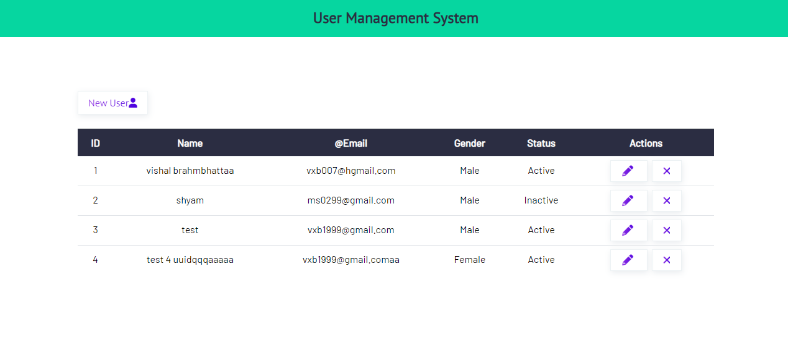
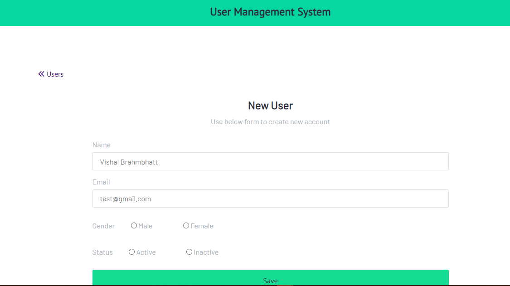
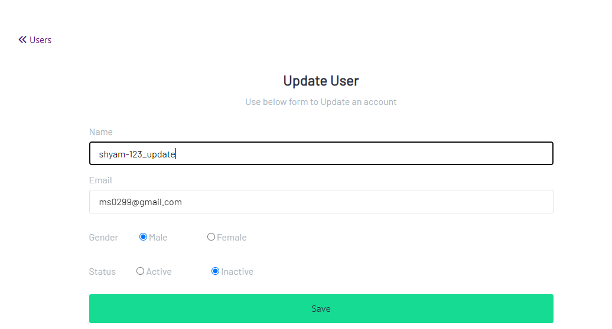
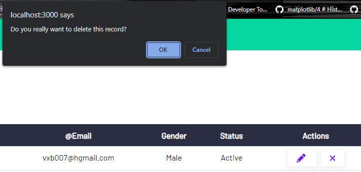

# Node_CRUD
Repo. for CRUD operation with node js and Mongo with express framework. Just ignore package name of MERN. 😅


## Installation

Install project with npm

```bash
  npm install 
  npm start 
```
    
## Screenshots


#### Home Page


#### New User


#### Update User


#### Delete



